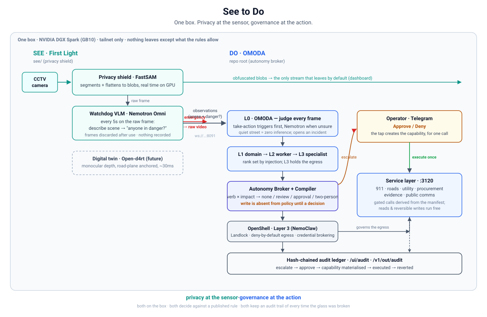

# Architecture: See to Do

One box on a city network watches a street and can act on what it sees, without
becoming a surveillance archive or an unsupervised agent. Two halves, one
pipeline, both on the edge:

- **See — First Light** (`see/`): the camera watches continuously, records
  nothing, and lets only an obfuscated blob-level stream leave the box. Raw video
  is released only when an on-device model detects a real emergency.
- **Do — OMODA** (repo root): the observations First Light emits are judged and,
  when they warrant it, turned into governed calls to city services. Any action
  that can cost money, create legal liability, or dispatch a real-world response
  is absent from the system until a recorded human decision creates it, for one
  call, then revokes it.

The through-line is one idea applied at both ends of the pipeline: **privacy at
the sensor, governance at the action.** First Light moves the privacy control
onto the camera; OMODA moves the human approval onto the capability. Both run on
the box, both decide against a published rule anyone can read, and both keep an
audit trail of every time the glass was broken.

---

## Why this matters

**On the See side, surveillance is a standoff.** People do not want to be watched
all the time; cities are restricting cameras because no one can say who is
watching or what happens to the footage. But when something goes wrong, everyone
wants officials to have what they need. First Light refuses the trade-off: by
default even the operators see only washed-out blobs, and a model on the box lifts
the shield to raw video only when a published rule says the public interest is
high enough.

**On the Do side, agent autonomy is the same standoff.** Every agent platform
holds dangerous capability open and asks the model not to use it yet. A system
prompt is not a security boundary, and an approval checked in application code is
only as good as the code. OMODA refuses that trade-off too: a consequential action
compiles to a policy that grants `GET` and nothing else, so the write method is
physically absent from the sandbox until a recorded human decision materialises
it, scoped to one method on one path and time-boxed, after which the runtime
revokes it.

**Together they are a city command center you can defend in public.** You can show
residents exactly what is normally visible (blobs), exactly what would trigger raw
video, and exactly which actions an agent can take unattended versus which require
a human. Coverage expands; the surveillance people object to does not.

---

## The shape



<details><summary>Same diagram as text</summary>

```
        ┌────────────────────────  one box on the tailnet (DGX Spark, GB10)  ────────────────────────┐
        │                                                                                              │
 camera │   SEE · First Light (see/)                          DO · OMODA (root)                        │
 ──────►│                                                                                              │
        │   ┌───────────────┐   obfuscated blobs ──────────────────────────────────────► dashboard    │
        │   │ Privacy shield│   (the only stream that leaves by default)                               │
        │   │  FastSAM      │                                                                          │
        │   └──────┬────────┘        observations (scene text + danger?)                               │
        │          │ raw frame       over ws://…:8091   ┌────────────────────────────────────────┐    │
        │   ┌──────▼────────┐  ───────────────────────► │ L0 OMODA: judge every frame            │    │
        │   │ Watchdog VLM  │                            │  triggers first, Nemotron when unsure  │    │
        │   │  Nemotron Omni│  emergency? ─► break glass │  opens an incident, routes to an L1     │    │
        │   └──────┬────────┘  (raw streams out)         └───────────────┬────────────────────────┘    │
        │          │ (frames discarded after use)                        │                              │
        │   ┌──────▼────────┐                            L1 domain expert (inference)                   │
        │   │ Digital twin  │ (future)                     └► L2 worker ──► L3 tool specialist          │
        │   │  Open-d4rt    │                                              │ holds the egress           │
        │   └───────────────┘                            ┌────────────────▼──────────────────────┐    │
        │                                                │ Autonomy Broker + Compiler (L2)         │    │
        │                                                │  verb × impact ─► none/review/approval/ │    │
        │                                                │  two-person; write absent until decided │    │
        │                                                └───────┬─────────────────┬───────────────┘    │
        │                                                        │ escalate        │ execute (once)     │
        │                                                   Telegram          OpenShell delta ──► service│
        │                                                  Approve/Deny       (Layer 3, on gateway) layer│
        │                                                        │                 │  :3120 (911, roads, │
        │                                                        └──► hash-chained ledger ◄── utility,   │
        │                                                             /ui/audit + /v1/out/audit  evidence)│
        └──────────────────────────────────────────────────────────────────────────────────────────────┘
```

</details>

---

## What runs on the box

Everything is on one Acer Veriton GN100 (DGX Spark, GB10, `gn100-390c`), tailnet
only. Nothing here depends on a cloud endpoint.

| Port | Process |
|---|---|
| `:8000` | Nemotron 3 Nano Omni (NVFP4) on vLLM — the local VLM/LLM, shared |
| `:8091` | First Light / COCO: `rgb-stream`, `observability`, `describe` |
| `:3110` | OMODA Action API + SSR admin UI (`/ui/...`) |
| `:3111` | OMODA stream ingest + outputs (`/v1/out/{frames,observations,agents,agentic,audit}`) |
| `:3120` | Mock city-services layer (911, roadside, utility, procurement, evidence, comms) |
| `:3131` | OpenShell gateway (NemoClaw), the Layer-3 enforcement point |
| `:3140` | Llama Nemotron Embed (NeMo Retriever), retrieval |

---

## See: First Light (`see/`)

Adapted from [`see/README.md`](see/), source
[`fredrikolis/leftover-cv-pipeline`](https://github.com/fredrikolis/leftover-cv-pipeline).

**Privacy shield: FastSAM.** Real time on the GPU. It segments everything and
flattens each segment to its mean colour. Layout and motion survive; faces,
plates, and fine detail do not. This obfuscated stream is the only thing that
leaves the device by default.

**Watchdog: the VLM, in two steps.** `nvidia/Nemotron-3-Nano-Omni-30B-A3B-Reasoning-NVFP4`
on vLLM, asked about the raw frame every 5 seconds. It describes the scene first
(which loads the image into the model), then asks "is anyone in danger / needs EMS
or police?" as a same-turn follow-up, so the image is already prefix-cached and the
safety check costs about 8 tokens. `true` breaks the glass and raw streams out;
`false` keeps the shield up. Frames are discarded the instant they are processed:
nothing is recorded, transmitted, or stored until the rule says the moment
warrants it. That is why the check must be a live VLM on the edge, not a cloud
service.

**Digital twin (future).** The same box can output 3D instead of pixels: Open-d4rt
gives coherent monocular depth from a fixed camera, ~30 ms/frame, anchored by
pinning the drivable road plane (SegFormer-b5) to global height 0 every frame so
the monocular scale stops drifting. The seed of a real-time, privacy-preserving
digital twin.

---

## Do: OMODA (repo root)

**Skills are the only input.** A capability exists only if a manifest at
`skills/<name>/omoda.skill.md` declares it. The compiler is the only writer of
policy and the manifest is its only input, so a skill cannot widen its own reach.
Undeclared is denied: a tool absent from every manifest gets no egress and fails
at Layer 3.

**The org chart, enforced by injection at load time.** Rank is not a label; it
decides what an agent is handed.

| Level | Role | Gets |
|---|---|---|
| L0 | orchestrator (**OMODA**) | inference; reviews every frame, routes incidents |
| L1 | domain expert (accident, fire, roadside, utility, comms) | inference + retrieval, **no tools**; directs L2 |
| L2 | worker (ambulatory, police, procurement, evidence-desk, …) | consent-free tools; delegates the dangerous ones |
| L3 | tool specialist (emergency-dispatch, procurement-gateway, utility-control, surveillance-ops, notify-gateway) | connectivity only, no task context; holds the governed egress |

An L2 has no inference client to be talked into calling; an L3 was never given the
task context it could leak. The compiler refuses an over-levelled manifest at boot.

**The two axes of danger.** The mechanism comes from the CRUD verb, **derived from
the call so it cannot be faked**; who must consent comes from the impact domain,
declared in the manifest.

| | Read | Create | Update | Delete |
|---|---|---|---|---|
| **No impact** | autonomous, silent | autonomous + ledger | autonomous + inverse | autonomous + inverse + `UNDO` |
| **financial / legal / reputational** | autonomous, logged | **approval** | **approval** + inverse | **two-person** + inverse |
| reputational only | | review | review | review |

A consequential write compiles to `GET` only; the write method is absent from
policy until a recorded decision materialises it for one call, then it reverts.

**The service layer** (`:3120`) is what the agents actually call: 911 dispatch
(fire/EMS/police), roadside/DOT, the county incident registry, private vendors
(crane, hazmat), the power/gas grid, CCTV cameras and evidence, and public
notification. `GET /api/catalog` reports, per route, whether it is OpenShell-gated,
read **live from the manifest**, so what the layer calls dangerous is by
construction what the platform gates. It is the tier OpenShell governs, and in
production the tier that routes each call to a real backend.

**Some capabilities have no decision path at all**, refused before any policy
check: a city-wide alert, a grid-wide blackout, facial recognition, a public
footage dump, and any change to the gateway's own credential brokering. These have
governed cousins one rung down (page one zone, de-energize one block, export one
clip); the extreme has none.

---

## The seam: how See drives Do

1. First Light publishes observations over `ws://…:8091` (a scene description plus
   a danger boolean), and the obfuscated frames on `rgb-stream`.
2. OMODA's L0 reviews **every** observation. Deterministic first: a curated
   take-action trigger list (`crash`, `smoke`, `overturned`, `downed power line`,
   `evacuate`, …) matches the scene text with a negation guard, so a quiet street
   costs zero inference. Only when a signal fires without a trigger does it fall
   through to Nemotron to judge whether it is an incident and of what kind.
3. A judged incident becomes one intent, routed to the L1 that owns it, which
   delegates down to the L3 that holds the service-layer egress.
4. The dangerous call escalates to the operator on Telegram (`Approve` / `Deny`).
   On a settled approval the Broker materialises the write, executes it against the
   service layer, and reverts. Reads and reversible writes never bother anyone.

Every hop is on two streams for the demo dashboard: `/v1/out/agents` (a
trigger-driven routing ticker: which agent, which incident, which action) and
`/v1/out/audit` (the full engagement, condensed from the ledger).

---

## Three layers, and we build the middle

| Layer | What | Whose |
|---|---|---|
| 1. Orchestration | org chart, tasks, review stages, the gateway | **Paperclip / OpenClaw**, upstream |
| 2. Policy determination | **compiler + Autonomy Broker** | **ours (OMODA)** |
| 3. Protections | Landlock FS confinement, deny-by-default L7 egress, dropped capabilities, credential brokering | **NVIDIA OpenShell** via NemoClaw |

The consent decision physically governs a capability because Layer 3 enforces the
blast radius below the model, and the agent never holds a credential: the gateway
brokers them. A recorded approval is what adds one endpoint to the live policy, for
one call.

---

## Approval, end to end

For every gated action the audit trail records the whole arc, grouped by incident:

```
escalated (awaiting approval)  ─►  approved by <operator>  ─►  capability materialised
      (write absent from policy)        (recorded decision)        (delta applied)
                                                                        │
                                                             executed against the service layer
                                                                        │
                                                                 delta reverted
```

A denial records `denied` and nothing executes. A two-person action records
`approved (1 of 2)` on the first tap and executes only when a second, distinct
operator settles it. The condensed view streams to the dashboard; the full
hash-chained record, with `argsHash`, the concrete target call, who decided, and
the chain state, lives behind the admin login at `/ui/audit`.

---

## Why the edge, and why NVIDIA

- **The privacy and zero-egress guarantees are only real on-device.** First
  Light's raw feed never leaves the box, and OMODA's router refuses to send a
  camera frame or a voice note to a hosted endpoint. That refusal is only coherent
  because the model is local.
- **Two NVIDIA models, load-bearing, all local.** Nemotron 3 Nano Omni (NVFP4,
  30B with ~3B active per token) is the First Light watchdog and OMODA's judge,
  planner, and voice/video transcriber; Llama Nemotron Embed (NeMo Retriever)
  serves retrieval. NVFP4 on Blackwell is what lets a 30B multimodal model answer
  on a desk-side machine at ~43 GB, and 121 GiB of unified memory is what lets the
  model, the perception pipeline, and a contained agent sandbox share one box.

---

## What is real, and what is next

Real and running on the box, under systemd, verified GREEN on the device:

- First Light privacy shield and the two-step watchdog VLM.
- OMODA broker, compiler, org chart, service layer, the full approval arc
  (escalate → approve → execute → revert), the hash-chained ledger and audit UI,
  the OpenShell sandbox as the real Layer 3.
- The See-to-Do seam: OMODA judges First Light's observations live and routes them.

Next:

- First Light's live digital twin (Open-d4rt) as a stream the dashboard renders.
- Two-person approvals need two enrolled operators; the box currently has one.
- The planner runs on the local Omni; a hosted NVIDIA key would let it use the
  Lightning planner where latency matters.

The full policy design is in [`prd/`](prd/); the stream contracts a dashboard or
integrator needs are in [`docs/`](docs/).
